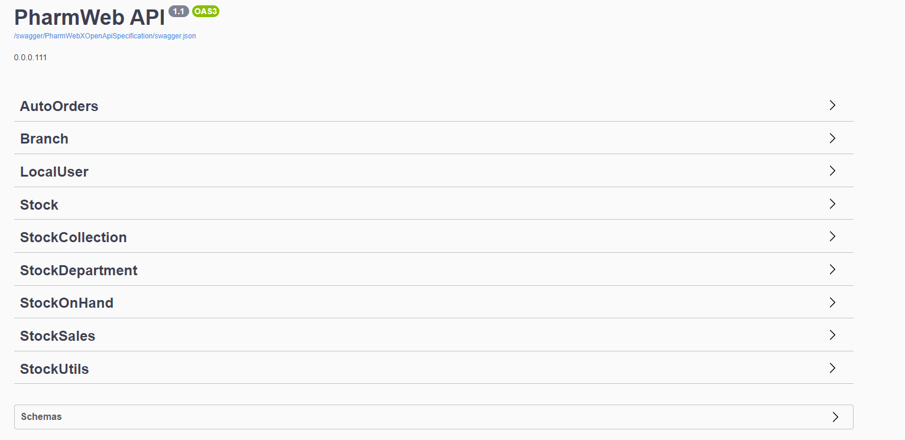

============
PharmWeb API
============

.. contents::
   :local:

--------------------------------------------------------------------------------------------------------------------------------------------

OverView
----------

.. important:: 
   To get the API swagger documetation, you can go to https://pharmwebapi.azurewebsites.net/index.html

.. attention::
   The Api is protected by a STS/IDP Server ..and requires a toke to gain access.
   

.. info:: API Response Layout
   All responses from the api will be in a standard layout, consistent response format for both successful and error results.
   
.. code-block:: json
    
   {
   "version": "string",
   "statusCode": 0,
   "message": "string",
   "isError": true,
   "responseException": {},
   "result": {}
   }

--------------------------------------------------------------------------------------------------------------------------------------------

URL Multi-Tenancy
-----------------
Multi-tenancy architecture helps us to share the resources cost-efficiently and securely in cloud environments where the single instance of the software runs on a server and serves multiple tenants. In which statelessness plays a major role in scaling for millions of concurrent users. Statelessness means that every Http request(API) happens in complete isolation. When the client makes an Http request, it includes all the information necessary for the server to fulfill that request.

Our API can route database persistance in multibile patterns, depending on the needs of the client, database persistance get route by the ``{__tenant__}`` in the url. This value wil be provided on enrolments

  /**Test**/api/v{version}/Test

Our Leganvy progarm Winscripts folloes the Single-tenant pattern, while the API uses Multi-tendant 1 or Multi-tendant 2 as shows below. 

.. image:: Images/Tendancy.png

--------------------------------------------------------------------------------------------------------------------------------------------

URI Versioning
--------------
To manage this complexity, version your API. Versioning helps us to iterate faster when the needed changes are identified in the APIs.

Using the URI is the most straightforward approach (and most commonly used as well) though it does violate the principle that a URI should refer to a unique resource. You are also guaranteed to break client integration when a version is updated.

The version need not be numeric, nor specified using the “v[x]” syntax.

  /Test/api/**v1**/Test
  
--------------------------------------------------------------------------------------------------------------------------------------------
 
API Calls
---------

.. Info::
   
   Please refer to https://pharmwebapi.azurewebsites.net/index.html for the full APi documentation
   
--------------------------------------------------------------------------------------------------------------------------------------------
   

AutoOrders
^^^^^^^^^^
.. admonition:: ``/{__tenant__}/api/v{version}/AutoOrders``

   **Auto Orders** call creates Orders in pharmweb to be send the a branch for dispesing, an *Autoorder* can be of type
   
AutoOrder Types 

* Script - Used to dispense a normal script on winscripts (OrderType = 0) 
* OrderDirect - Used to send stock orders (OrderType = 1)
* OrderWise - Used to send stock orders (OrderType = 2)
* XProCure - Used to send stock orders (OrderType = 3)
* Orders (WareHouse Order) - Used to send automated orders from a warehouse (OrderType = 4) 
* ERx (WareHouse Order) - Used to send Scriopts to brances for stock control (OrderType = 5)

**Getting Orders**
  Fetching of Orders will only be used by *Winscripts* to :superscript:`Auto Dispense` at the branch.
  
**Adding Orders**
  Adding of orders will create a order depending on the branch to be send to be  :superscript:`Auto Dispense` at each branch.
  
  To create an Order a POST request needs to be made at ``/{__tenant__}/api/v{version}/AutoOrders`` with a *json* body as shown below.
  
  .. code-block:: json

    {
    "branchCode": "1111111",
    "orderName": "RX1", 
    "referenceNo": "1",
    "dateTime": "2022-01-10T12:00:00.000Z",
    "referenceDate": "2022-01-10T12:00:00.000Z",
    "numberOfItems": "2",
    "customerInfo": {
        "branchId": "12345678",
        "firstName": "JACK",
        "surname": "DANIELS",
        "title": "MR",
        "idNumber": "7908125066081",
        "masNumber": "123",
        "mainMemberDepCode": "1",
        "initials": "J",
        "dateAdded": "2022-01-10T12:00:00.000Z",
        "work": "555-5555",
        "home": "666-6666",
        "cellular": "0734571345",
        "eMail": "mrdaniels@jackdanilsupholstry.com",
        "refCode": "123",
        "custMasInfo": {
            "primaryMasNumber": "123",
            "primaryPayCode": "CASH",
            "primaryMasCode": "CAS"
        }
    },
    "orderStatus": "1",
    "orderType": "5",
    "items": [
        {
            "branchStockId": "703987001",
            "cost": "50.00",
            "quantity": "1",
            "retail": "100.00",
            "stockDescription": "ALTOSEC 20MG CAP 28",
            "itemNo": "1",
            "nappiCode": "703987001",
            "dosage": "TDS",
            "ddu": "30",
            "barCode": "",
            "repeats": "6",
            "currRepeat": "1",
            "days": "30"
        },
        {
            "branchStockId": "768375010",
            "cost": "100.00",
            "quantity": "2",
            "retail": "500.00",
            "stockDescription": "ADCO SYNALEVE CAP 100",
            "itemNo": "2",
            "nappiCode": "768375010",
            "dosage": "2 TIMES DAILY",
            "ddu": "TDS",
            "barCode": "",
            "repeats": "12",
            "currRepeat": "1",
            "days": "30"
        }
    ]
}
  
**Required Fields** 

  ``orderName`` **type:** *string* **maxLength:** **100** *minLength:* **0** :subscript:`(Ordername can be anyname as log as its unique with every POST)`
  
  ``referenceNo`` *type:* **string** *maxLength:* **100** *minLength:* **0** :subscript:`(Reference number as unique trasnaction number from the external source)`    

  ``branchCode`` *type:* **string** *maxLength:* **10** *minLength:* **0** :subscript:`(This is a branch ref code, you can get a list for brachces for the API)`     
   
  ``branchId`` *type:* **string** *maxLength:* **100**  :subscript:`(This is a unique customerid from from the external software)`     
   
  ``title`` *type:* **string** *maxLength:* **7**
    
  ``firstName`` *type:* **string** *maxLength:* **7**

  ``surname`` *type:* **string** *maxLength:* **30**

  ``stockDescription`` *type:* **string** *maxLength:* **100**
  
  ``branchstockId`` :subscript:`(This is a unique stockid from from the external software)`     

  ``quantity`` *type:* **number** **

  ``cost`` *type:* **number** *maxLength:* **30**

  ``retail`` *type:* **number** *maxLength:* **30**
  
--------------------------------------------------------------------------------------------------------------------------------------------
 
Branch
^^^^^^
.. admonition:: ``/{__tenant__}/api/v{version}/Branch``

   **Branch** Add and register branches, for external users only GET post wil be used to get all branches BranchCode, 
 
.. infomation:: BranchCode

   BranchCode ..is every branch unique indetifier to be used when adding orders ot getting stock for example, this is used to filter the results.
   
--------------------------------------------------------------------------------------------------------------------------------------------
   
Stock
^^^^^
.. admonition:: ``/{__tenant__}/api/v{version}/Stock``

   **Stock URL** is used to get and maintain individial stock items, all normal CRUD call can be made for single items.

.. infomation:: BranchStockId

   BranchStockId ..is  unique indetifier to be used when adding stock, with all fields supplied on post, it can generate a ID for you, or you can use an external value fot this.

--------------------------------------------------------------------------------------------------------------------------------------------

StockCollection
^^^^^^^^^^^^^^^
.. admonition:: ``/{__tenant__}/api/v{version}/StockCollectionController``

   **StockCollection** Adds a new stock master file to the DB ....you can use a collection array json to POST stock. This opion is the quickest when adding stock.

.. infomation:: BranchStockId

   BranchStockId ..is  unique indetifier to be used when adding stock, with all fields supplied on post, it can generate a ID for you, or you can use an external value fot this.
   
--------------------------------------------------------------------------------------------------------------------------------------------
   
   

   
